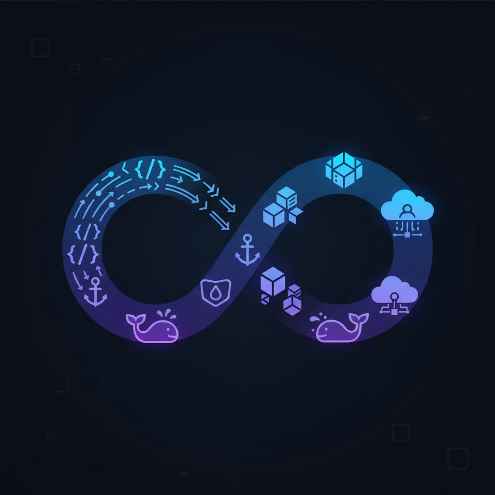 

# GitOps & DevOps: From Code to Kubernetes on macOS

[](https://github.com/cicero-w/devops-portfolio-project/actions/workflows/ci.yml)
[](https://hub.docker.com/r/cicero2/devops-portfolio-backend)
[](https://hub.docker.com/r/cicero2/devops-portfolio-frontend)
[](https://github.com/cicero-w/devops-portfolio-project/blob/master/LICENSE)

**Complete implementation of a DevOps pipeline for a web application using modern practices: CI/CD, Infrastructure as Code, Kubernetes, and GitOps, tailored for a local development environment.**

## Project overview

This project demonstrates the full deployment cycle of a cloud-native application (Todo App) using a modern DevOps stack. The goal is to create a reliable, automated, and secure pipeline from code to production without relying on paid cloud services. This setup is perfect for local development and portfolio demonstration on a macOS environment.

**Author:** 0c2pus \
**Contact:** [LinkedIn](linkedin) \
**Live Demo:** http://localhost:30080 (Kubernetes) | http://your-vm-ip (VM deployment)

---

## System Architecture

_The architecture is designed to be self-contained and free, leveraging local virtualization and containerization tools on macOS._

## Infrastructure Evolution

```bash
Stage 1-3: Mac → GitHub Actions → DockerHub → Ansible → VM (Docker Compose)
Stage 4:   Mac → GitHub Actions → DockerHub → ArgoCD → Kubernetes (Helm)
```

### Components:
1. **Source code:** GitHub repository with GitFlow branching strategy
2. **CI/CD:** GitHub Actions for building, testing, and scanning images
3. **Image registry:** DockerHub with multi-architecture support (AMD64/ARM64)
4. **Local Infrastructure:** Kind Kubernetes cluster on Docker Desktop
5. **Infrastructure as Code:** Ansible for VM provisioning, Helm for Kubernetes
5. **Containerization:** Docker with multi-stage builds and security scanning
6. **Orchestration:** Kubernetes with resource management and health monitoring
6. **GitOps:** ArgoCD for automated deployments from Git
7. **Monitoring:** Prometheus/Grafana stack for observability

---

## Technology Stack

| Category | Technologies |
|-----------|------------|
| **Local Environment** | macOS, UTM (Ubuntu Server VM), Docker Desktop |
| **Infrastructure as Code** | Ansible, Helm |
| **CI/CD** | GitHub Actions, Hadolint, Trivy |
| **Containers** | Docker, Docker Compose |
| **Orchestration & GitOps** | Kubernetes (Kind), Helm, ArgoCD |
| **Monitoring** | Prometheus, Grafana |
| **Web Servers** | Nginx (Reverse Proxy) |
| **Programming** | Node.js (Express), React (Vite) |
| **Database** | SQLite |
| **Version Control** | Git, GitHub |
| **Image Registry** | DockerHub |

---

## Repository Structure

<pre>
devops-portfolio-project/
├── infrastructure/
│   ├── ansible/
│   │   ├── inventory.ini           # Server inventory and variables
│   │   └── setup-vm.yml            # Complete VM provisioning playbook
│   └── k8s/
│       ├── portfolio-app/          # Helm chart for application
│       │   ├── Chart.yaml
│       │   ├── values.yaml
│       │   └── templates/          # Kubernetes manifests
│       │       ├── backend-*.yaml
│       │       ├── frontend-*.yaml
│       │       └── nginx-*.yaml
│       └── monitoring/
│           └── prometheus-values.yaml
├── .github/
│   └── workflows/
│       └── ci.yml                  # CI/CD Pipeline with multi-arch build
├── app/
│   ├── backend/                    # Node.js API server
│   │   ├── src/
│   │   ├── Dockerfile              # Multi-stage production build
│   │   ├── healthcheck.js
│   │   └── package.json
│   └── frontend/                   # React client
│       ├── src/
│       ├── Dockerfile              # Multi-stage with Nginx
│       ├── nginx.conf
│       └── package.json
├── nginx/                          # Reverse proxy configuration
│   ├── nginx.conf
│   └── default.conf
├── docker-compose.yml              # Development orchestration
├── docker-compose.prod.yml         # Production orchestration
└── README.md
</pre>

---

## Current Status

### Stage 0: Preparation (Completed)
- [x] Created public GitHub repository
- [x] Initialized folder structure with GitFlow workflow
- [x] Added base application code (Node.js backend + React frontend)
- [x] Configured `main` and `develop` branches

### Stage 1: Manual VM Setup and Docker Deployment (Completed)
- [x] VM Configuration: Ubuntu Server VM in UTM with bridged networking
- [x] SSH Access: Passwordless SSH connection from macOS to VM
- [x] Docker Installation: Docker CE and Docker Compose on VM
- [x] Application Containerization:
    + Multi-stage Dockerfile for React frontend with Nginx
    + Optimized Node.js backend Dockerfile with security best practices
    + Health checks for all services
- [x] Reverse Proxy Setup: Nginx with load balancing, security headers, rate limiting
- [x] Multi-Container Architecture: Docker Compose with resource limits and health monitoring
- [x] Production Deployment: Full-stack application accessible via VM IP

### Stage 2: Build and Security Automation (CI) (Completed)
- [x] DockerHub Integration: Public repositories with automated publishing
- [x] GitHub Secrets: Secure credential management
- [x] GitHub Actions CI Pipeline:
    + Dockerfile linting with Hadolint
    + Multi-architecture builds (AMD64/ARM64)
    + Container functionality testing
    + Security vulnerability scanning with Trivy
    + SARIF report upload to GitHub Security
- [x] CI/CD Features:
    + Parallel job execution
    + Artifact caching
    + Conditional publishing
    + Cross-platform compatibility

### Stage 3: Infrastructure as Code (Ansible) and Deployment Automation (CD) (Completed)
- [x] Ansible Controller Setup: Configured on macOS with community collections
- [x] Infrastructure Automation:
    + Complete VM provisioning from bare Ubuntu
    + Multi-architecture support (ARM64/AMD64)
    + Git-based deployment workflow
    + Dynamic environment configuration
- [x] Production Pipeline:
    + One-command deployment from clean VM to running application
    + Automated health verification
    + Idempotent operations
    + Tagged execution for selective deployment
- [x] DevOps Best Practices:
    + Version-controlled infrastructure
    + Immutable infrastructure principles
    + Centralized configuration management
    + End-to-end automated testing

### Stage 4: Kubernetes and GitOps (Completed)
- [x] Kubernetes Cluster: Kind cluster on Docker Desktop
- [x] Helm Chart Development:
    + Comprehensive chart for backend, frontend, and nginx
    + Parameterized configuration with values.yaml
    + Kubernetes-native health checks (liveness/readiness probes)
    + Resource limits and requests for production readiness
- [x] ArgoCD GitOps:
    + ArgoCD installation in dedicated namespace
    + Application configured to track GitHub repository
    + Automatic synchronization enabled
    + Self-healing and pruning configured
- [x] Monitoring Stack:
    + Prometheus Operator for metrics collection
    + Grafana for visualization and dashboards
    + Kubernetes cluster metrics monitoring
    + Resource usage tracking per namespace

Key Achievements:
  - Complete GitOps workflow: Git → ArgoCD → Kubernetes
  - Declarative infrastructure management
  - Automated deployment on Git changes
  - Production-grade monitoring and observability


---

## Kubernetes Deployment

### Architecture Overview

```bash
Git Repository (develop branch)
        ↓
    ArgoCD (GitOps Controller)
        ↓
Kubernetes Cluster (Kind)
    ↓
Helm Chart Deployment
    ├── Backend Pods (2 replicas)
    ├── Frontend Pods (2 replicas)
    └── Nginx Pod (1 replica)
        ↓
    NodePort Service (30080)
        ↓
    http://localhost:30080
```

## Deployment Commands

### Prerequisites:

```bash
# Install required tools
brew install kind kubectl helm

# Create Kind cluster
kind create cluster --name devops-portfolio
```

### Deploy application:

```bash
# Install Helm chart manually
helm install portfolio-app infrastructure/k8s/portfolio-app -n portfolio --create-namespace

# Deploy through ArgoCD UI (GitOps approach)
# 1. Open ArgoCD UI at http://localhost:8080
# 2. Click "NEW APP" and configure as described in documentation
# 3. ArgoCD will automatically sync from Git repository
```

### Access application:
- Application: http://localhost:30080
- ArgoCD UI: http://localhost:8080
- Grafana: http://localhost:3000

## GitOps Workflow
1. Make changes in Git repository (values.yaml or templates)
2. Commit and push to develop/main branch
3. ArgoCD detects changes automatically (1-3 minutes)
4. Application synchronizes to desired state
5. Kubernetes updates running pods

---

## Infrastructure as Code with Ansible

<details>
<summary>Architecture Overview</summary>
  
```bash
Mac (Ansible Controller) → SSH → Ubuntu VM (Managed Node) → Docker Containers
```

</details>
<details>
<summary>Usage</summary>

Prerequisites:
```bash
brew install ansible
ansible-galaxy collection install community.docker
```

Full Deployment:
```bash
ansible-playbook -i infrastructure/ansible/inventory.ini infrastructure/ansible/setup-vm.yml
```

Selective Deployment:
```bash
# Docker setup only
ansible-playbook -i infrastructure/ansible/inventory.ini infrastructure/ansible/setup-vm.yml --tags docker

# Application deployment only
ansible-playbook -i infrastructure/ansible/inventory.ini infrastructure/ansible/setup-vm.yml --tags deploy
```

Key Features:
  + Multi-architecture support (ARM64/AMD64)
  + Dynamic configuration via inventory
  + HAutomated health verification
  + Error recovery with retry logic
  + Modular execution with tags

</details>

---

## CI/CD Pipeline Details

<details>
<summary>Multi-Architecture Build Support</summary>
  
All Docker images are built for both AMD64 (Intel/AMD) and ARM64 (Apple Silicon) architectures using GitHub Actions and Docker Buildx.

</details>

<details>
<summary>Workflow Triggers:</summary>
  
- Push to main/develop: Full pipeline with DockerHub publishing
- Pull Requests to main: Build, test, and scan without publishing
- Manual dispatch: On-demand pipeline execution

</details>

<details>
<summary>Pipeline Stages:</summary>
  
1. Lint Dockerfiles
    + Hadolint validation
    + Best practices enforcement
    + Security and optimization checks

2. Build, Test, and Scan
    + Multi-stage Docker builds
    + Container functionality tests
    + Trivy vulnerability scanning
    + SARIF report generation

3. Publish to Registry
    + Multi-architecture manifests
    + Multi-tag strategy (branch, SHA, latest)
    + Conditional publishing

</details>

<details>
<summary>Security Features:</summary>
  
- Automated vulnerability scanning on every commit
- SARIF reports uploaded to GitHub Security tab
- Risk-assessed vulnerability management
- Token-based authentication with minimal permissions

</details>

---

## Monitoring and Observability

<details>
<summary>Prometheus/Grafana Stack</summary>

- Installation:
```bash
helm install prometheus prometheus-community/kube-prometheus-stack \
  --namespace monitoring \
  --values infrastructure/k8s/monitoring/prometheus-values.yaml
```

- Access dashboards:
```bash
# Grafana (default: admin/admin123)
kubectl port-forward svc/prometheus-grafana -n monitoring 3000:80 &

# Prometheus
kubectl port-forward svc/prometheus-kube-prometheus-prometheus -n monitoring 9090:9090 &
```

- Available metrics:
  + Kubernetes cluster resource usage
  + Pod CPU and memory consumption
  + Network I/O statistics
  + Application health status

</details>

---

## Local Development

### Prerequisites:

Before you start, make sure that your computer has:
* Node.js 18+
* npm
* Git

### Quick Start
<details>
<summary>1. Clone repository:</summary>
  
```bash
   git clone https://github.com/0c2pus/devops-portfolio-project.git
   cd your-repository
```
</details>
<details>
<summary>2. Start backend</summary>

```bash
    cd app/backend
    npm install
    npm run dev
    # Available at http://localhost:8000
```
</details>
<details>
<summary>3. Start frontend</summary>

```bash
    cd app/frontend
    npm install
    npm run dev
    # Available at http://localhost:5173
```
</details>

---

## System Operation Screenshots

<details>
<summary>Stage 0: Local Development</summary>

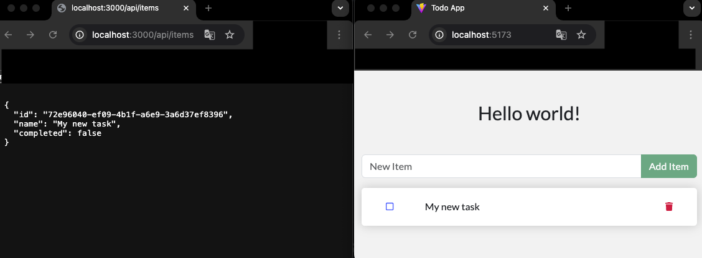
_Todo application running locally with Node.js backend and React frontend_

</details>
<details>
<summary>Stage 1: Production Deployment on VM</summary>

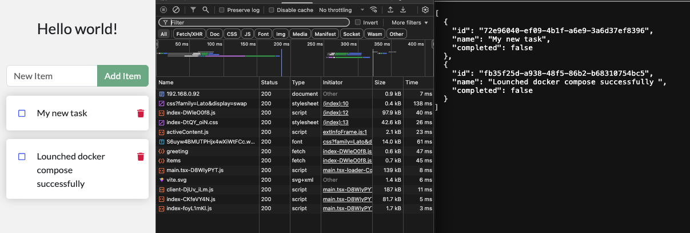
_Full-stack application deployed on Ubuntu VM with Docker containers_

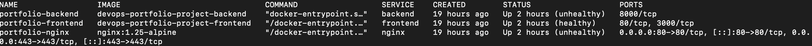
_All services running with health checks in Docker Compose_

</details>
<details>
<summary>Stage 2: CI/CD Pipeline</summary>

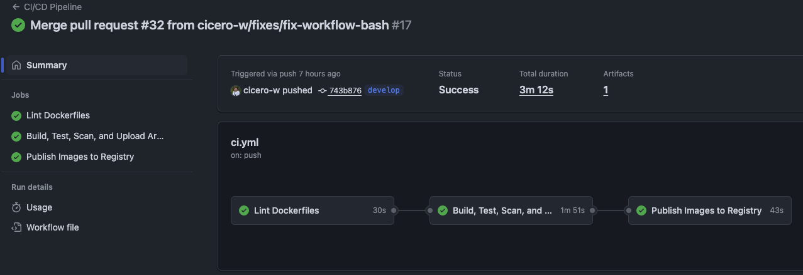
_GitHub Actions workflow run showing all jobs (Lint, Build/Test/Scan, Publish) with green checkmarks_

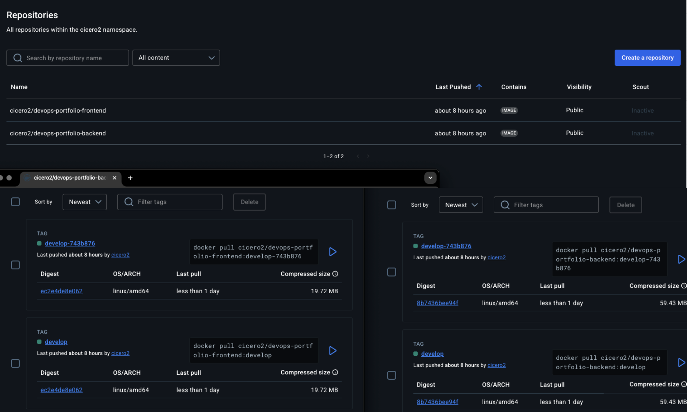
_DockerHub repositories showing published images with multiple tags (main, develop, SHA tags)_

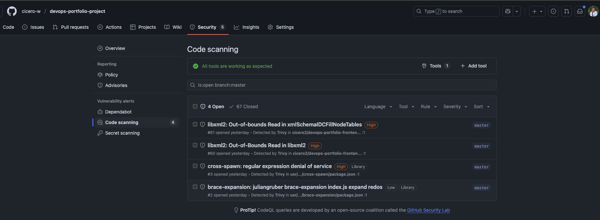
_GitHub Security tab displaying Trivy scan results with vulnerability reports for both containers_

</details>
<details>
<summary>Stage 3: Infrastructure as Code</summary>

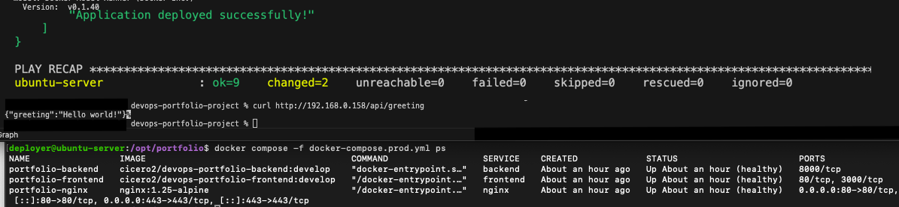
_Ansible playbook execution showing successful completion with task summary (ok=X, changed=Y, failed=0) and final verification of deployed services_

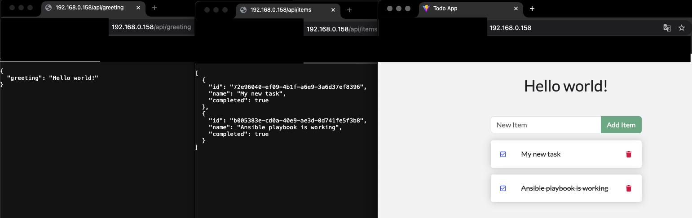
_Terminal showing one-command deployment: ansible-playbook command followed by successful API test (curl http://vm-ip/api/greeting) and browser verification_

</details>
<details>
<summary>Stage 4: Kubernetes and GitOps</summary>

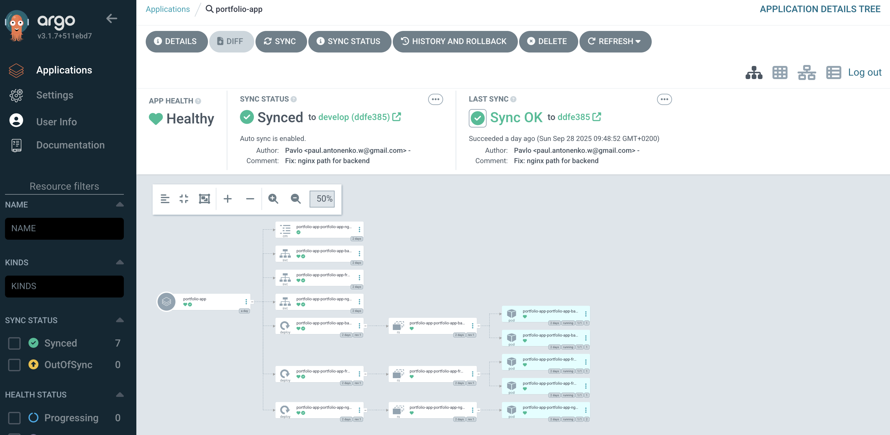
_ArgoCD UI showing portfolio-app with "Synced" and "Healthy" status, displaying all Kubernetes resources_

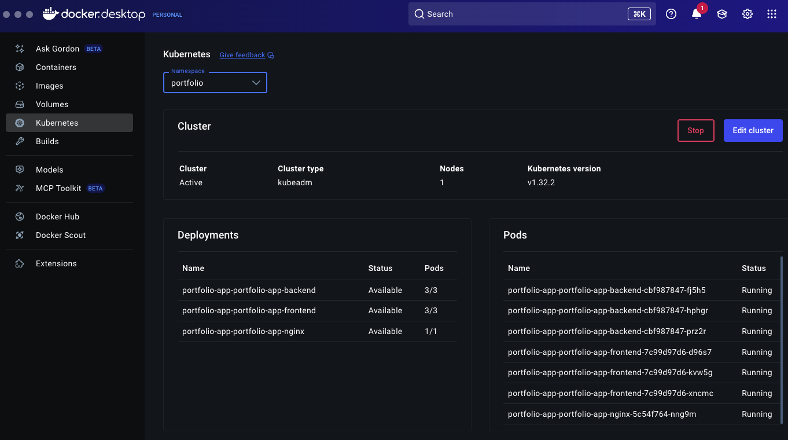
_Kubernetes dashboard or kubectl get pods output showing all running pods in portfolio namespace_

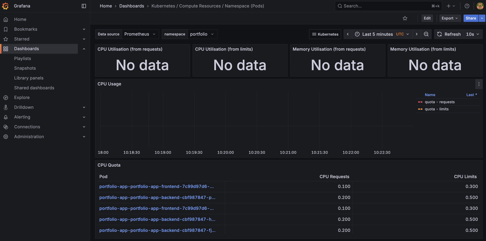
_Grafana dashboard showing Kubernetes cluster metrics for portfolio namespace_

</details>

---

## Known Security Issues

This section demonstrates production-ready vulnerability management practices

<details>
<summary>Container Base Images</summary>

- libxml2 CVEs (High): Alpine Linux upstream vulnerabilities
  + Status: Monitoring for Alpine security updates
  + Impact: No direct application functionality affected
  + Mitigation: Network isolation, security headers, regular updates

</details>
<details>
<summary>Application Dependencies</summary>

- cross-spawn ReDoS (High): Regular expression denial of service potential
  + Status: Risk accepted - low exploitability in containerized environment
  + Mitigation: Resource limits, timeout configurations
- brace-expansion (Low): Minor dependency vulnerability
  + Status: Monitoring for package maintainer updates

</details>
<details>
<summary>Security Approach</summary>

- Continuous automated scanning on every commit
- Risk assessment based on business impact
- Prioritized remediation by severity and exploitability
- Complete audit trail in GitHub Security tab

</details>

---

## Roadmap

- [x] Stage 0: Repository preparation and base code
- [x] Stage 1: Manual VM deployment with Docker Compose
- [x] Stage 2: CI/CD automation with GitHub Actions
- [x] Stage 3: Infrastructure as Code with Ansible
- [x] Stage 4: Kubernetes orchestration and GitOps with ArgoCD

---

## License
This project is licensed under the MIT License - see the [LICENSE](LICENSE) file for details.

## Contribution
Contributions are welcome! Please feel free to submit issues and pull requests
